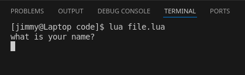
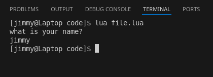

# Chapter 1: IO
> last updated: 2025-03-25  

There's no program that doesn't take in input and give output, some common forms are:  
- to and from a console window (a traditionally black and white window that can only display text)
- to and from a file
- to and from another program
- to and from a Graphical User Interface (GUI), which is the most common form of Input and output (IO) as of today.

This book will mostly use console output for any sort of output as it's the easiest and quickest to do, however we'll go through the console output, file output, and GUI output in this Chapter.

---
# CONSOLE
---

## Output to a console window
this arguably the easiest way to check if a piece of code is getting reached, it shows output to a window called a *terminal emulator*, mostly called cmd in windows, and it usually looks like this:  
  
the above picture was the output of the following piece of code
```lua
print("hello world")
```
 you might also find them called standard output and input  

## Input to a console window
Easiest way to get input for a program, input is usually done with a keyboard in an input field and is almost always in text  
  
notice how it's different from output where it ended the program right away? It's waiting asking for input  
  
the above picture was the output of the following piece of code
```lua
print("what is your name?")
io.read()
```
 you might also find them called standard output and input

