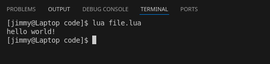

# Chapter 1: IO
> last updated: 2025-03-25  

There's no program that doesn't take in input and give output, some common forms are:  
- to and from a console window (a traditionally black and white window that can only display text)
- to and from a file
- to and from another program
- to and from a Graphical User Interface (GUI), which is the most common form of Input and output (IO) as of today.

This book will mostly use console output for any sort of output as it's the easiest and quickest to do, however we'll go through the console output, file output, and GUI output in this Chapter.

## Output to a console window
this arguably the easiest way to check if a piece of code is getting reached, it shows output to a window called a *terminal emulator*, mostly called cmd in windows, and it usually looks like this:  
  
the above picture was the output of the following piece of code
```lua
print("hello world")
```
