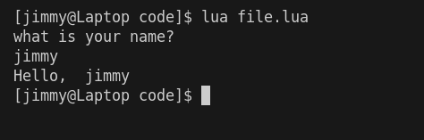

# Chapter 2: Variables  
as you've seen in [Chapter 1](./chapter_1.md) how we can get input from different sources for our program, but how do we actually use them though? Using something like `io.read()` only gives the computer the instruction to *take in* input, but not to remember it, that's where variables come in.  

Let's be clear on one thing, no program runs on the hard disk drive (HDD) or solid state drive (SSD) directly, any and all programs are first moved onto the RAM in order to work properly, no matter how fast your SSD is, it's not faster than your RAM, the RAM is also closer to the CPU which makes it faster, but in turn this will always mean whatever data you store will be deleted after you close your program unless you save it to a place in your SSD.  
So when I say "store" from now on I will my referring to you RAM and not in a physical file somewhere on your computer.  

## What are variables  
Variables are like a box which you can put one thing in, they're a place in memory only big enough for One value, they're also a way to remember these values later on the program because you  give them a name.  

## How to use variables

### Declaration  
Say you see something like this in your code
```lua
local name = io.read()
```
we already know that `io.read()` takes in input, but what's that to it's left? The keyword `local` tells the program "I want to assign whatever input comes in to a place in memory" and the part before the equal sign is a name, so now you're telling the computer "I want to assign whatever input comes in to a place in memory, and name 'name' for whenever I need it again", the equal sign just say that it'll be assigned whatever value is on the right.  

### Types of variables
As we established that variables are a space in memory for one thing, it's important to know how does it know how much of a space to assign? The answer is data types.  
Generally, there's a handful of data types in every programming language called *primitive data types* and those are
1. integer (also called int for short): these are numbers that aren't decimals and can't have a decimal point `eg: -1,0,1,2,3,4,...`
2. float (short for floating point numbers): these are *decimal* numbers with a decimal point `eg 1.0, 0.5, -1.2,...`
3. double: floats have a limit to how big they can get, so if they're not enough for you, you can use doubles
4. char (short for characters): they are one character `eg: a,b,أ, ö`
5. strings: these are multiple characters, can be a word, a sentence, a paragraph, or the declaration of independence.

Some languages might not offer strings as a datatype, and some might not use a keyword like `local` to declare a variable, you just write the name and it'll figure it out, so check how to declare them for each language you might use.

### using a variable
how do you call for someone you know that's standing far from you? You use their name! That's exactly how you use a variable too :D  
so say we've shown the user a prompt asking for their name as follows
```lua
print("what is your name? ")
local name = io.read()
```
this told the computer "I want you to show the user the sentence 'what is your name?' and then save whatever the user inputs into a place in the memory called name"
now that gives us a way to use it by calling the "name" like this
```lua
print("Hello, ", name)
```
that tells the computer "show the user the sentence 'Hello, ' followed by whatever value is inside the place named 'name'" which should give us an output like this  
  
also, using variable names anywhere in your code with replace them with their value while your code is running allowing you to use variables in many other ways other than just outputting them!  
For example:  
- arithmetic
  ```lua
    local a = 2
    local b = 3
    local c = a + b 
    print(c) -- 5
  ```
- string manipulation
  ```lua
  local a = "Hi "
  local b = "There!"
  local c = a .. b 
  print(c) --Hi There!
  ```
you might have realised I use -- sometimes which isn't something I've explained yet, those are called comments, your computer will ignore them while trying to execute your code, they're meant for you or other people who read the code later on.
